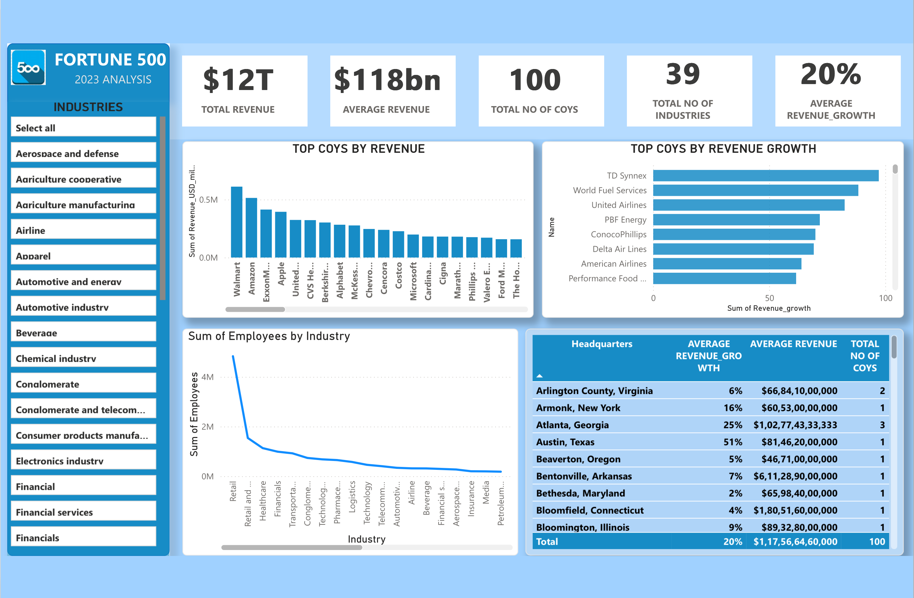

# 🏆 Fortune 500 — Revenue & Growth Analysis with Web Scraping

<div align="center">


**A full-pipeline data analytics project — scraping live Fortune 500 data directly from Wikipedia, cleaning and analysing it in Python and SQL Server, then visualising industry dominance, revenue leaders, and growth champions in an interactive Power BI dashboard.**

[🔍 Problem Statement](#-problem-statement) · [📁 Repo Structure](#-repository-structure) · [🛠️ Tech Stack](#️-tech-stack) · [🕷️ Scraping Pipeline](#️-web-scraping-pipeline) · [📊 Dashboard](#-dashboard-preview) · [💡 Key Insights](#-key-insights) · [⚙️ Setup](#️-setup--how-to-run) · [🚀 Future Scope](#-future-scope--whats-next)

</div>

---

## 📌 Problem Statement

> **The challenge:** The Fortune 500 list is one of the most cited datasets in business journalism — but it lives as a static Wikipedia table that most analysts either ignore or download manually once and never refresh. There's no readily available, clean, analysis-ready version that answers the questions business teams actually ask.

Three core analytical questions drive this project:

- **Who truly dominates?** — Revenue ranking tells one story, but growth rate tells another. Which companies are winning on both axes simultaneously?
- **Which industries are structurally rich vs. temporarily inflated?** — A single high-revenue company can distort an industry's average; understanding total vs. average revenue by sector requires proper aggregation
- **Where is the Fortune 500 geographically concentrated?** — Revenue and growth by headquarters city reveals which economic corridors produce the world's largest companies

This project solves all three by building a **fully automated Python scraping and cleaning pipeline** that pulls live data from Wikipedia, then running **14 SQL queries** for structured analysis, and finally surfacing every finding in a **single-page interactive Power BI dashboard** with industry, geography, and company-level filters.

---

## 📁 Repository Structure

```
Fortune-500-Companies-Revenue-Growth-Analysis-with-Web-Scraping/
│
├── 🐍 wikipedia_scraper.py        # End-to-end Python script:
│                                  # 1. Scrapes Fortune 500 table from Wikipedia
│                                  # 2. Parses HTML with BeautifulSoup
│                                  # 3. Cleans Revenue & Revenue Growth columns
│                                  # 4. Exports to FORTUNE_500.csv
│                                  # 5. Runs full EDA + 8 visualisations
│                                  #    (histograms, bar charts, boxplot, pair plot)
│
├── 📄 FORTUNE_500.csv             # Scraped & cleaned dataset — 100 companies
│                                  # 7 columns: Rank, Name, Industry,
│                                  # Revenue (USD millions), Revenue growth,
│                                  # Employees, Headquarters
│
├── 🗄️ SQL_ANALYSIS_2024-25.sql   # SQL Server script — data cleaning +
│                                  # 14 analytical queries covering revenue,
│                                  # growth, employees, industry, and geography
│
└── 📊 ANALYSIS_POWER_BI.pbix     # Single-page Power BI dashboard
│                                   # KPI cards · Top companies by revenue &
│                                  # growth · Employees by industry ·
│                                  # HQ-level revenue & growth table
│
└── Dashboard Screenshot.png
```

---

## 🛠️ Tech Stack

| Tool | Purpose | Why It Was Used |
|------|---------|-----------------|
| **Python 3.x** | Core scripting language | Handles the full pipeline — HTTP requests, HTML parsing, data cleaning, and visualisation — in a single executable script |
| **Requests** | HTTP page fetching | Fetches the live Wikipedia page content as raw HTML for BeautifulSoup to parse |
| **BeautifulSoup4** | HTML parsing & table extraction | Locates the correct `wikitable sortable` table on the Wikipedia page and extracts all rows and headers into a structured Pandas DataFrame |
| **Pandas** | Data manipulation & CSV export | Cleans the scraped data (strips `$`, `,`, `%` from numeric fields), runs EDA operations, and exports the clean dataset to `FORTUNE_500.csv` |
| **NumPy** | Numerical support | Supports Pandas operations during EDA and statistical summaries |
| **Matplotlib & Seaborn** | Python visualisations | Produces 8 chart types inline — revenue histogram, growth histogram, top-10 bar charts, industry boxplot, pair plot, and revenue-by-industry/HQ bar charts |
| **SQL Server** | Structured querying & analysis | Runs 14 analytical queries on the imported CSV — aggregations by industry, headquarters, revenue ranges, and growth statistics |
| **Power BI Desktop** | Interactive business dashboard | Single-page report with industry slicer, KPI cards, and 4 chart types — brings all SQL and Python findings into one shareable, filterable view |

---

## 🕷️ Web Scraping Pipeline

The entire data collection and preparation flow runs in a **single Python script** (`wikipedia_scraper.py`):

```
Wikipedia Page
"List of largest companies in the United States by revenue"
(https://en.wikipedia.org/wiki/List_of_largest_companies_in_the_United_States_by_revenue)
        │
        ▼
  requests.get(url)
  → Raw HTML fetched
        │
        ▼
  BeautifulSoup(page.text, "html.parser")
  → Targets soup.find_all('table')[1]
  → Extracts all <th> headers as column names
  → Loops every <tr> row, extracts <td> cells
  → Builds Pandas DataFrame on-the-fly
        │
        ▼
  EDA Pass
  → df.head(), df.info(), df.describe()
  → df.isnull().sum() — null check
  → df.duplicated().sum() — duplicate check
  → df['Industry'].unique() / value_counts()
  → df['Headquarters'].unique() / value_counts()
  → df.sort_values('Revenue growth', ascending=False).head(10)
        │
        ▼
  Data Cleaning
  → Revenue: strip '$' and ',' → cast to float
  → Revenue growth: strip '%' → divide by 100 → float
        │
        ▼
  8 Visualisations (Matplotlib + Seaborn)
  → Revenue Distribution (histogram + KDE)
  → Revenue Growth Distribution (histogram + KDE)
  → Top 10 Companies by Revenue (bar chart)
  → Top 10 Companies by Revenue Growth (bar chart)
  → Revenue by Industry (boxplot)
  → Pair Plot — Revenue vs Revenue Growth
  → Total Revenue by Industry (grouped bar)
  → Total Revenue by Headquarters (grouped bar)
        │
        ▼
  df.to_csv('FORTUNE_500.csv', index=False)
  → 100 rows × 7 columns exported
```

---

## 🗄️ SQL Analysis — 14 Business Queries

All queries run on the imported `FORTUNE_500` table in **SQL Server**. The script covers both data cleaning and analytical interrogation.

**Data Cleaning in SQL:**

```sql
-- Strip % from Revenue_growth and cast to DECIMAL
UPDATE FORTUNE_500 SET Revenue_growth = REPLACE(Revenue_growth, '%', '');
ALTER TABLE FORTUNE_500 ALTER COLUMN Revenue_growth DECIMAL(5,2);

-- Strip commas from Employees and cast to INT
UPDATE FORTUNE_500 SET Employees = REPLACE(Employees, ',', '') WHERE Employees LIKE '%,%';
ALTER TABLE FORTUNE_500 ALTER COLUMN Employees INT;
```

**Analytical Queries:**

| # | Business Question | Query Type |
|---|-------------------|------------|
| 1 | Top 10 companies by revenue | `ORDER BY Revenue_USD_millions DESC` |
| 2 | Top 10 companies by revenue growth | `ORDER BY Revenue_growth DESC` |
| 3 | All distinct industry categories | `SELECT DISTINCT Industry` |
| 4 | Total number of unique companies | `COUNT(DISTINCT Name)` |
| 5 | Total number of unique industries | `COUNT(DISTINCT Industry)` |
| 6 | Total revenue by industry | `GROUP BY Industry, SUM(Revenue)` |
| 7 | Average revenue & average growth by industry | `GROUP BY Industry, AVG(Revenue), AVG(Growth)` |
| 8 | Total employees by industry | `GROUP BY Industry, SUM(Employees)` |
| 9 | Average employees by industry | `GROUP BY Industry, AVG(Employees)` |
| 10 | Average revenue by headquarters city | `GROUP BY Headquarters, AVG(Revenue)` |
| 11 | Number of companies per industry | `GROUP BY Industry, COUNT(*)` |
| 12 | Min, Max, Avg revenue across all companies | `MIN / MAX / AVG(Revenue)` |
| 13 | Avg, Min, Max revenue growth across all companies | `AVG / MIN / MAX(Revenue_growth)` |
| 14 | Each industry's revenue share as % of total | `SUM(Revenue) / Total * 100` |

---

## 📊 Dashboard Preview

### Fortune 500 — 2023 Analysis
> *Single-page Power BI dashboard with industry slicer, 5 KPI cards, top companies by revenue & growth, employees by industry trend, and a headquarters-level revenue & growth table.*



---

## 🔍 Key Insights

> *All figures verified directly from `FORTUNE_500.csv` (100 rows). No numbers are assumed.*

---

### 📦 Top-Line Performance (2023 Data)

- **100 companies** across **37 unique industries** and **71 headquarters cities** make up this dataset
- **Total combined revenue: $12,234,609M (~$12T)** — confirmed by the dashboard KPI card
- **Average revenue per company: $122,346M (~$118bn as shown on dashboard)** — driven upward significantly by Walmart ($648B) and Amazon ($574B) at the top
- **Average revenue growth: 6.1%** across the 100 companies — masking extreme variance from −41.7% to +125.9%
- **Total workforce across all 100 companies: 16,267,793 employees** — an average of ~162,677 per company

---

### 🏢 Top Companies by Revenue

| Rank | Company | Revenue (USD millions) |
|------|---------|----------------------|
| 1 | Walmart | $648,125M |
| 2 | Amazon | $574,785M |
| 3 | Apple | $383,482M |
| 4 | UnitedHealth Group | $371,622M |
| 5 | Berkshire Hathaway | $364,482M |

- **Walmart and Amazon alone account for over $1.2T** of the $12T total — roughly 10% of the entire Fortune 500 top-100 revenue concentrated in just 2 companies
- **Apple's revenue declined −2.8%** in this period despite ranking 3rd by total revenue — the largest absolute-dollar revenue contraction in the dataset

---

### 📈 Top Companies by Revenue Growth

| Company | Revenue Growth |
|---------|---------------|
| Nvidia | 125.9% |
| Goldman Sachs | 57.8% |
| Citigroup | 55.1% |
| JPMorgan Chase | 54.7% |
| Bank of America | 49.4% |

- **Nvidia's 125.9% growth** is the single most extreme data point in the dataset — more than double the next-highest grower, driven by the AI/GPU infrastructure boom
- The **top 5 fastest-growing companies** include 4 financial institutions (Goldman Sachs, Citigroup, JPMorgan Chase, Bank of America) — reflecting a period of sharp interest rate and trading revenue expansion for US banks
- The dashboard's "Top Cos by Revenue Growth" chart highlights **TD Synnex and World Fuel Services** as additional high-growth outliers in the technology distribution and energy sectors

---

### 🏭 Industry Insights

- **Financials is the most represented industry** with 13 companies — the largest single-sector group in the top 100
- **Retail (10 companies) and Petroleum industry (9 companies)** are the next most represented
- **Healthcare and Pharmaceuticals** together account for 12 companies — the second-largest combined sector after financials
- The **Retail industry dominates total employee count** — Walmart (2.1M) and Amazon (1.525M) alone give retail the highest sum-of-employees by a wide margin, as confirmed by the dashboard's employee-by-industry chart which shows a steep drop-off after the retail peak
- **Austin, Texas** (home to Dell and Tesla) shows the highest average revenue growth among major HQ cities at **51%**, followed by **Atlanta, Georgia at 25%**
- **New York City** hosts the most Fortune 500 top-100 companies at **13**, followed by Houston at **6**

---

### 💰 Revenue Distribution Insights

- **Revenue is highly right-skewed** — the histogram reveals that the majority of companies cluster in lower revenue bands, with a long tail pulled by a handful of mega-cap firms
- **Min revenue in the top 100: $43,452M** — even the 100th-ranked Fortune 500 company generates over $43 billion annually
- **Revenue growth distribution is near-normal** around the 6.1% average, with notable negative outliers (petroleum companies facing commodity price normalisation) and positive outliers (Nvidia, banks)
- The **pair plot of Revenue vs. Revenue Growth** shows no strong linear correlation — high revenue does not predict high growth, and vice versa (Walmart grows at 6%, Nvidia at 125%)

---

## ⚙️ Setup & How to Run

### Prerequisites

```bash
pip install requests beautifulsoup4 pandas numpy matplotlib seaborn
```

- **SQL Server** (or SQL Server Express) — [Download here](https://www.microsoft.com/en-us/sql-server/sql-server-downloads)
- **Power BI Desktop** — [Download here](https://powerbi.microsoft.com/en-us/desktop/)

### Step 1 — Clone the Repository

```bash
git clone https://github.com/yanshiSharma/Fortune-500-Companies-Revenue-Growth-Analysis-with-Web-Scraping.git
cd Fortune-500-Companies-Revenue-Growth-Analysis-with-Web-Scraping
```

### Step 2 — Run the Scraper & EDA

```bash
python wikipedia_scraper.py
```

This will:
- Fetch the live Wikipedia Fortune 500 table
- Print EDA summaries to the console
- Display all 8 visualisation charts inline
- Export the cleaned dataset as `FORTUNE_500.csv`

> **Note:** The script scrapes live data — output may differ slightly from the committed `FORTUNE_500.csv` if Wikipedia has been updated since the last run.

### Step 3 — Run the SQL Analysis

```sql
-- In SQL Server Management Studio (SSMS):
-- 1. Import FORTUNE_500.csv via:
--    Right-click database → Tasks → Import Flat File → select FORTUNE_500.csv

-- 2. Run the full analysis script:
--    Open SQL_ANALYSIS_2024-25.sql → Execute (F5)
```

### Step 4 — Open the Power BI Dashboard

1. Open **`ANALYSIS_POWER_BI.pbix`** in Power BI Desktop
2. If prompted about the data source path, go to **Home → Transform Data → Data Source Settings** and point it to your local `FORTUNE_500.csv`
3. Click **Home → Refresh** to reload all visuals

### Step 5 — Explore the Dashboard

- Use the **Industries slicer** (left panel) to filter all visuals to any industry or combination of industries
- Click any bar in the **Top Cos by Revenue** or **Top Cos by Revenue Growth** charts to cross-filter the headquarters table
- Hover over chart elements for **exact values in tooltips**

---

## 🚀 Future Scope — What's Next

| Enhancement | Description |
|-------------|-------------|
| **📅 Multi-Year Trend Scraping** | Extend `wikipedia_scraper.py` to scrape Fortune 500 data from multiple years (2020–2025) and build a YoY revenue and growth trend comparison page in Power BI |
| **🌍 Global Fortune 500 Expansion** | Scrape the Global Fortune 500 Wikipedia page to compare US dominance against European, Chinese, and Asian conglomerates by industry |
| **🤖 Automated Refresh Pipeline** | Schedule the scraper via a cron job or GitHub Actions to re-scrape Wikipedia weekly and auto-update `FORTUNE_500.csv` — making the dataset always current |
| **📉 Growth vs. Revenue Correlation Model** | Build a Python regression model to quantify the relationship between company size (employees, revenue) and growth rate — test whether larger companies systematically grow slower |
| **🗺️ US Geography Heatmap** | Plot headquarters locations on a US choropleth map (using Plotly or Power BI Maps) to visually show which states and cities dominate Fortune 500 revenue concentration |
| **🏭 Industry Sector Drill-Down** | Add a second Power BI page for industry deep-dives — showing individual company rankings, revenue share, and growth within each sector via drill-through filters |
| **📊 Percentile & Outlier Analysis** | Add SQL window functions (`NTILE`, `PERCENT_RANK`) to bucket companies into revenue and growth quartiles — enabling percentile-based benchmarking for each industry |
| **💹 Stock Price Correlation** | Join Fortune 500 data with Yahoo Finance historical stock prices (via `yfinance`) to test whether revenue growth correlates with stock performance in the same fiscal year |

---

## 💡 Skills Demonstrated

```
✅ Live web scraping — HTTP requests + BeautifulSoup HTML table parsing
✅ Dynamic DataFrame construction from scraped HTML rows
✅ Data cleaning in Python — regex stripping of $, commas, % + type casting
✅ Exploratory Data Analysis — null checks, duplicates, unique value counts, sort/filter
✅ 8 Python visualisations — histograms, bar charts, boxplot, pair plot (Matplotlib + Seaborn)
✅ CSV export of scraped + cleaned data for downstream use
✅ SQL Server data cleaning — UPDATE + ALTER COLUMN for type normalization
✅ 14 SQL analytical queries — aggregations, GROUP BY, subqueries, percentage share
✅ Single-page Power BI dashboard with industry slicer and 4 visual types
✅ DAX KPI cards — Total Revenue, Average Revenue, Total Companies, Industries, Avg Growth
✅ Business insight generation — revenue leaders, growth champions, industry dominance
✅ End-to-end pipeline thinking: scrape → clean → analyse → visualise
```

---

## 📬 Connect

**Yanshi Sharma** — Data Analyst

[](https://github.com/yanshiSharma)

---

<div align="center">
<sub>Built with 🐍 Python + 🗄️ SQL + 📊 Power BI · Part of Data Analytics Portfolio</sub>
</div>
